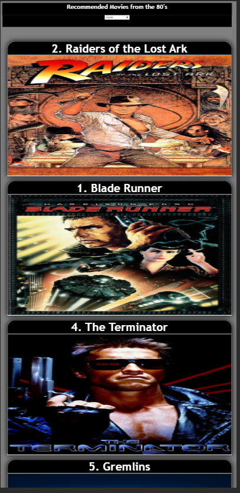

# ASSESSMENT

## HOW TO RUN
1. Open shell/command promt
2. Navigate to the directory where you want the code to be cloned
3. run the command: git clone from https://github.com/psharath23/tata_elxsi.git
4. go to directory: cd tata_elxsi
5. npm install
6. npm start

## APP FUNCTIONALITY
1. localhost:8080/ will load all the movies
2. Changing the dropdown will change the order of movies
3. localhost:8080/<rank> , eg: localhost:8080/1 will load the movie with rank 1
4. Clicking on the Movie Card will expand and Synopsis and Rank are visible

## SCREEN SHOTS

